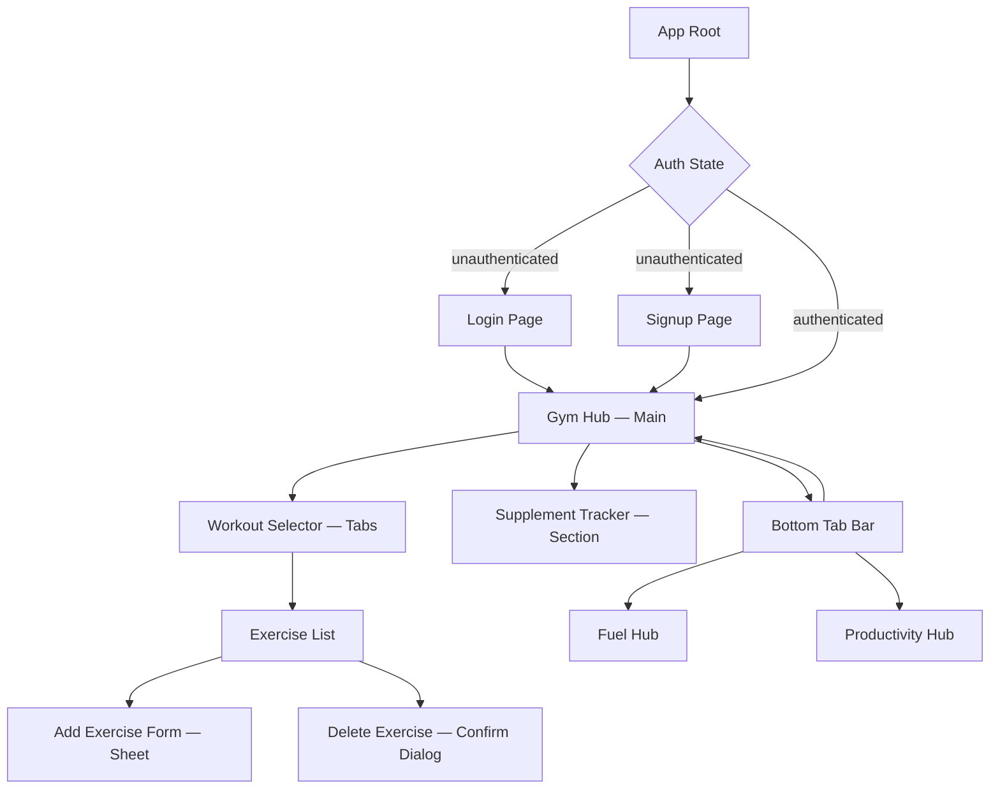
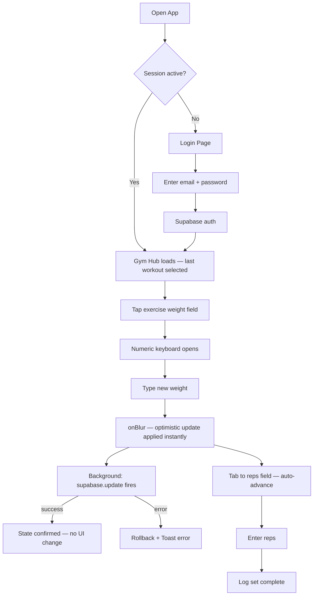
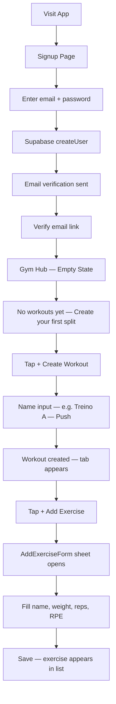
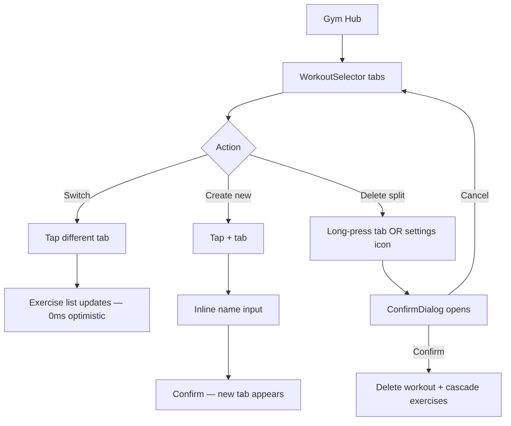

# Gym Hub — Frontend Specification

**Version:** 1.0 — Brownfield Discovery  
**Author:** Uma (UX Design Expert Agent)  
**Date:** 2026-05-07  
**Audience:** Senior / Tech Lead  
**Status:** Ready for Phase 4 Consolidation

---

## Change Log

| Date | Version | Description | Author |
|------|---------|-------------|--------|
| 2026-05-07 | 1.0 | Initial frontend spec — Brownfield Discovery Phase 3 | Uma (@ux-design-expert) |

---

## Executive Summary

The Gym Hub frontend is already architecturally 50% migrated. `gym/index.html` is a full React 18 SPA running via CDN (Babel standalone + Tailwind CDN) — not plain HTML. The SaaS Premium visual language (glass morphism, gym-gradient, Inter font) is established and should be preserved, not redesigned.

**The migration goal is extraction, not redesign.** Move the existing React components into a Vite 5 project, replace `fetch()` calls with Supabase hooks, and add the two missing screens (Login, Signup) that block multi-tenant launch.

**Critical prerequisite:** The database migration (Sprint 0) must complete before any frontend launch. Zero `user_id` fields means all users share the same data — the frontend cannot safely go live on the current schema.

---

## Section 1 — UX Goals & Design Principles

### Primary Persona

**Lucas & Friends — Gym Users**

- Age: 20–30, tech-comfortable
- Context: logging exercises mid-workout, one-handed, between sets
- Device: iPhone / Android mid-range, mobile-only
- Goal: minimum friction between sets — log weight, reps, RPE in under 10 seconds
- Pain point: current app loses context on refresh (no persistence per user)

### Usability Goals

| Goal | Metric |
|---|---|
| Log a set | ≤ 3 taps from home screen |
| Add new exercise | ≤ 5 taps |
| Switch workout split | ≤ 2 taps |
| View supplement status | Visible on home without scrolling |
| Auth (returning user) | ≤ 2 taps (remember session) |

### Design Principles

1. **Speed over completeness** — show data instantly (optimistic updates), sync in background
2. **Focused surface** — one workout at a time, no dashboard noise
3. **Dark by default** — gym environments are bright; high-contrast dark UI reduces eye strain
4. **Progressive disclosure** — advanced options (RPE, notes) below the fold; core logging above
5. **Zero learning curve** — UI mirrors mental model of a paper training log

---

## Section 2 — Information Architecture

### Sitemap



### Screen Inventory

| Screen | Route | Status | Priority |
|---|---|---|---|
| Gym Hub Main | `/gym` | Exists (CDN) | P0 |
| Login | `/login` | Missing | P0 |
| Signup | `/signup` | Missing | P0 |
| Add Exercise Sheet | modal/sheet | Exists (inline) | P0 |
| Delete Confirm Dialog | modal | Missing | P1 |
| Fuel Hub | `/fuel` | Exists (separate) | P2 |
| Productivity Hub | `/productivity` | Exists (separate) | P2 |

### Bottom Tab Navigation

```
[ Gym ] [ Fuel ] [ Productivity ]
  ▲ active indicator — gym-gradient underline
  min-h: 56px · equal-width flex · safe-area-inset-bottom
```

---

## Section 3 — User Flows

### Flow 1 — Mid-Workout Exercise Logging



### Flow 2 — New User Onboarding



### Flow 3 — Workout Split Management



---

## Section 4 — Wireframes

### Screen 1 — Gym Hub Main (Existing)

```
┌─────────────────────────┐
│ ▓▓▓▓▓ GYMHUB    [user] │  ← header: gym-gradient wordmark + avatar
├─────────────────────────┤
│ [Treino A] [Treino B] + │  ← WorkoutSelector tabs (snap-x scroll)
├─────────────────────────┤
│ ┌─ glass card ────────┐ │
│ │ Bench Press     [↑] │ │  ← canIncreaseNext badge
│ │ ○ 80kg  ○ 3x10  7  │ │  ← weight · reps · RPE
│ └─────────────────────┘ │
│ ┌─ glass card ────────┐ │
│ │ Squat               │ │
│ │ ○ 100kg ○ 4x8   8  │ │
│ └─────────────────────┘ │
│                         │
│      [ + Add Exercise ] │  ← gym-gradient button
├─────────────────────────┤
│ SUPPLEMENTS             │
│ ○ Whey      ○ Creatine  │  ← Toggle rows
├─────────────────────────┤
│  [Gym]  [Fuel]  [Prod]  │  ← BottomTabBar
└─────────────────────────┘
```

### Screen 2 — Add Exercise Sheet (Existing)

```
┌─────────────────────────┐
│ ░░░░░░░░░░░░░░░░░░░░░░░ │  ← dimmed overlay
│                         │
│ ┌─ sheet slide-up ────┐ │
│ │ Add Exercise    [X] │ │
│ │                     │ │
│ │ Name                │ │
│ │ [_______________]   │ │
│ │                     │ │
│ │ Weight (kg)  Reps   │ │
│ │ [_______]  [______] │ │
│ │                     │ │
│ │ RPE (1-10)          │ │
│ │ [___]               │ │
│ │                     │ │
│ │ [  Save Exercise  ] │ │  ← gym-gradient button
│ └─────────────────────┘ │
└─────────────────────────┘
```

### Screen 3 — Supplement Tracker (Existing)

```
┌─────────────────────────┐
│ SUPPLEMENTS             │
│ ─────────────────────── │
│ 💊 Whey Protein  [●○○] │  ← Toggle: emerald when on
│ 🔵 Creatine      [○○○] │  ← Toggle: slate when off
│                         │
│ Tap to mark daily intake│  ← caption text
└─────────────────────────┘
```

### Screen 4 — Login Page (NEW — P0)

```
┌─────────────────────────┐
│                         │
│        GYMHUB           │  ← gym-gradient wordmark, centered
│   Your training partner │  ← slate-400 subtitle
│                         │
│ ┌─────────────────────┐ │
│ │ Email               │ │
│ │ [_______________]   │ │
│ └─────────────────────┘ │
│                         │
│ ┌─────────────────────┐ │
│ │ Password            │ │
│ │ [_______________]   │ │
│ └─────────────────────┘ │
│                         │
│ [      Log In         ] │  ← gym-gradient button
│                         │
│  Don't have an account? │
│       Sign up           │  ← text link, orange-500
│                         │
└─────────────────────────┘
```

### Screen 5 — Empty State (NEW — P1)

```
┌─────────────────────────┐
│ ▓▓▓▓▓ GYMHUB    [user] │
├─────────────────────────┤
│                         │
│                         │
│         🏋️              │  ← Dumbbell icon, icon-xl, slate-600
│                         │
│   No workouts yet       │  ← text-primary
│   Create your first     │  ← text-secondary
│   training split        │
│                         │
│  [ + Create Workout  ]  │  ← gym-gradient button
│                         │
│                         │
├─────────────────────────┤
│  [Gym]  [Fuel]  [Prod]  │
└─────────────────────────┘
```

---

## Section 5 — Component Library / Design System

### Approach

Custom token layer over Tailwind — no external component library. Rationale: the gym-gradient + glass morphism aesthetic is bespoke; shadcn/radix would require overriding nearly every visual default. Tailwind utility-first with `tailwind.config.js` token extension is the correct fit.

### Design Token Foundation

```
tokens/
├── colors.ts       → slate palette + gym-gradient + semantic tokens
├── typography.ts   → Inter scale + tracking presets
├── spacing.ts      → Tailwind spacing extensions
├── shadows.ts      → card-shadow, glass shadow
└── animation.ts    → transition timing curves
```

### Color Tokens

| Token | Value | Usage |
|---|---|---|
| `gym-gradient-from` | `orange-500` | Primary action, active state |
| `gym-gradient-to` | `red-600` | Primary gradient end |
| `surface-glass` | `rgba(255,255,255,0.1)` | Card backgrounds |
| `surface-dark` | `slate-900` | App background |
| `surface-elevated` | `slate-800` | Card/panel base |
| `surface-border` | `slate-700` | Dividers |
| `text-primary` | `white` | Headlines |
| `text-secondary` | `slate-300` | Labels, captions |
| `text-muted` | `slate-500` | Placeholders |
| `success` | `emerald-400` | Completion, canIncreaseNext |
| `rpe-low` | `emerald-400` | RPE 1–4 |
| `rpe-mid` | `yellow-400` | RPE 5–7 |
| `rpe-high` | `red-400` | RPE 8–10 |

### Typography Tokens

| Token | Value |
|---|---|
| `font-display` | `Inter, sans-serif` |
| `weight-black` | `900` (headings) |
| `weight-bold` | `700` (subheadings) |
| `weight-medium` | `500` (labels) |
| `tracking-tight` | `-0.025em` (uppercase headers) |
| `tracking-widest` | `0.15em` (badges, micro-labels) |

### Existing Components (extracted from gym/index.html)

| Component | Current State | Migration Target |
|---|---|---|
| `ExerciseCard` | Inline JSX, optimistic update | `components/gym/ExerciseCard.tsx` |
| `WorkoutSelector` | Tab strip, useState | `components/gym/WorkoutSelector.tsx` |
| `SupplementTracker` | Toggle row | `components/gym/SupplementTracker.tsx` |
| `AddExerciseForm` | Inline form | `components/gym/AddExerciseForm.tsx` |
| `BottomTabBar` | Implicit via pb-20 hack | `components/layout/BottomTabBar.tsx` |

### New Components Required

| Component | Purpose | Priority |
|---|---|---|
| `AuthForm` | Login + Signup screens | P0 |
| `EmptyState` | No workouts / first-run | P1 |
| `ConfirmDialog` | Delete workout confirmation | P1 |
| `RPEBadge` | Color-coded RPE indicator | P1 |
| `ProgressIndicator` | canIncreaseNext flag display | P2 |
| `UserAvatar` | Session user display in header | P2 |
| `Toast` | Optimistic update feedback | P2 |
| `SkeletonCard` | Loading state for exercises | P2 |

### Component Architecture — Atomic Design

```
atoms/
  Button (primary=gym-gradient, ghost, destructive)
  Input (dark surface, focus ring orange-500)
  Toggle (supplement checkboxes)
  Badge (RPE, fuel type)
  Icon (Lucide — subset only)

molecules/
  ExerciseRow (weight + reps + RPE + canIncrease flag)
  WorkoutTab (label + active indicator)
  SupplementRow (icon + label + Toggle)
  FormField (Input + Label + error state)

organisms/
  ExerciseCard (ExerciseRow[] + drag handle)
  WorkoutSelector (WorkoutTab[] + scroll)
  SupplementTracker (SupplementRow[])
  AddExerciseForm (FormField[] + submit)
  AuthForm (FormField[] + Button + logo)

templates/
  GymLayout (BottomTabBar + content slot)
  AuthLayout (centered card on dark bg)

pages/
  GymPage
  LoginPage
  SignupPage
```

### ExerciseCard — Key States

```
Default:      slate-800 bg, card-shadow, all fields editable
Active/Focus: orange-500 ring on focused input
canIncrease:  emerald-400 badge "↑ Add weight next session"
Saving:       opacity-70 + spinner (optimistic update in flight)
Error:        red-400 border + inline message
Empty:        EmptyState organism
```

---

## Section 6 — Branding & Style Guide

### Visual Identity

**Brand DNA:** Focused intensity — dark surfaces that recede, gradient accents that demand attention, glass layers that create depth without distraction.

**Wordmark:** `GYMHUB` — Inter font-black, uppercase, tracking-tight, gym-gradient text fill (`background-clip: text`).

### Full Color Palette

```
BACKGROUND SYSTEM
  app-bg:          slate-950  (#020617)
  surface:         slate-900  (#0f172a)
  surface-raised:  slate-800  (#1e293b)
  surface-glass:   white/10
  border:          slate-700  (#334155)

BRAND GRADIENT
  gym-gradient:    linear(135deg, orange-500 → red-600)

SEMANTIC
  success:         emerald-400 (#34d399)
  warning:         yellow-400  (#facc15)
  danger:          red-400     (#f87171)
  info:            sky-400     (#38bdf8)

TEXT HIERARCHY
  text-primary:    white
  text-secondary:  slate-300
  text-muted:      slate-500
  text-inverse:    slate-900
```

### Typography Scale

```
Display:   Inter 900  · 2rem    · uppercase · tracking-tight  → screen titles
Heading:   Inter 700  · 1.25rem · uppercase · tracking-tight  → section headers
Subhead:   Inter 600  · 1rem    ·           · normal          → card titles
Body:      Inter 500  · 0.875rem·           · normal          → labels, inputs
Caption:   Inter 500  · 0.75rem ·           · tracking-widest → badges, micro-labels
Mono:      JetBrains Mono 400 · 0.875rem                      → weight/reps values
```

> Weight and reps values render in JetBrains Mono (tabular figures) to prevent layout shift during optimistic updates.

### Icon System — Lucide React (subset)

| Icon | Usage |
|---|---|
| `Dumbbell` | Gym nav, workout header |
| `Plus` / `X` | Add / dismiss |
| `ChevronRight` / `ChevronDown` | Navigation |
| `Check` | Completion, supplement toggle |
| `TrendingUp` | canIncreaseNext indicator |
| `Trash2` | Delete (red-400) |
| `User` | Auth / profile |
| `Fuel` | Fuel Hub nav |
| `LayoutDashboard` | Productivity nav |
| `LogOut` | Session end |
| `Loader2` | Spinner (animated) |

**Size tokens:** `icon-xs: 12px` · `icon-sm: 16px` · `icon-md: 20px` · `icon-lg: 24px` · `icon-xl: 32px`

### Glass Morphism Spec

```css
/* tailwind.config.js → extend.utilities */
'.glass': {
  'background': 'rgba(255, 255, 255, 0.05)',
  'backdrop-filter': 'blur(10px)',
  '-webkit-backdrop-filter': 'blur(10px)',
  'border': '1px solid rgba(255, 255, 255, 0.1)',
}
```

Rules: glass cards always on `slate-900` or darker. Never stack two glass layers. Active state: `rgba(255,255,255,0.1)` + `orange-500/20` tint.

### Motion Principles

| Principle | Rule |
|---|---|
| Immediate feedback | Optimistic updates apply in `<16ms` |
| Subtle transitions | `duration-150` default |
| Easing | `ease-out` entrances, `ease-in` exits |
| No decorative loops | Looping only for explicit loading states |

**Timing tokens:**

```
transition-fast:    150ms ease-out  — button hover, toggle
transition-base:    200ms ease-out  — card mount, tab switch
transition-slow:    300ms ease-out  — sheet slide-up, dialog
transition-exit:    150ms ease-in   — dismiss, unmount
```

**Micro-interactions:**

```
Button press:       scale-95 on active (100ms)
Tab switch:         bottom indicator slides (200ms)
Exercise card add:  fade-in + translateY(8px → 0) (200ms)
Delete confirm:     shake 3× before dialog opens
canIncrease badge:  pulse once on mount (emerald glow)
Saving state:       Loader2 spin (700ms linear infinite)
```

### Spacing & Layout

```
Mobile container:   max-w-md (448px) · mx-auto
Content padding:    px-4 (16px)
Card padding:       p-4
Section gap:        space-y-3 (12px)
Bottom nav height:  64px (pb-16 content clearance)
Top safe area:      pt-safe (env(safe-area-inset-top))
```

---

## Section 7 — Accessibility & Responsiveness

### Compliance Target

**WCAG 2.1 AA** — mandatory. Mid-workout context (sweaty hands, bright gym lighting) makes accessibility a functional requirement.

### Color Contrast

| Pairing | Ratio | WCAG AA |
|---|---|---|
| `white` on `slate-900` | 15.3:1 | ✓ Pass |
| `slate-300` on `slate-900` | 7.2:1 | ✓ Pass |
| `slate-500` on `slate-900` | 3.6:1 | ✓ Pass (large text) |
| `white` on `gym-gradient` | 4.8:1 | ✓ Pass |
| `emerald-400` on `slate-900` | 8.1:1 | ✓ Pass |
| `red-400` on `slate-900` | 5.2:1 | ✓ Pass |

> Glass cards on `slate-900` pass AA. Glass on dynamic backgrounds must be individually verified.

### Touch Targets

```
Button (primary):    min-h-[48px]  full-width mobile
Icon buttons:        min-w-[44px] min-h-[44px]
Tab items:           min-h-[56px]  equal-width flex
Exercise inputs:     min-h-[52px]  (above standard — mid-workout ergonomics)
Toggle:              48×28px       thumb 24×24px
```

### Focus Management

```
Focus ring:         outline-2 outline-offset-2 outline-orange-500
Focus-visible only: focus-visible:ring-2 (hidden on mouse/touch)
Modal/Dialog:       Focus trapped on open, returns to trigger on close
Sheet:              First focusable field auto-focused on mount
Tab order:          Logical DOM order — no tabindex > 0
```

### ARIA Patterns

| Pattern | Implementation |
|---|---|
| Exercise card | `role="group"` + `aria-label="[exercise name]"` |
| RPE badge | `aria-label="RPE 8 out of 10 — high intensity"` |
| Supplement toggle | `role="switch"` + `aria-checked` |
| Loading state | `aria-live="polite"` on save region |
| Delete confirm | `role="alertdialog"` + `aria-describedby` |
| Tab bar | `role="tablist"` + `aria-selected` |
| canIncrease | `aria-label="Ready to increase weight next session"` |

### Reduced Motion

```css
@media (prefers-reduced-motion: reduce) {
  /* All transitions → instant */
  /* Loader2 → static icon */
  /* Card mount animations → none */
}
```

Use `motion-safe:` and `motion-reduce:` Tailwind variants throughout.

### Responsive Strategy

```
Base (default):    320px–448px   — primary design surface
sm (640px+):       tablet        — optional 2-col exercise grid
md (768px+):       desktop       — max-w-md preserved
lg+ (1024px+):     not designed  — max-w-md ceiling enforced
```

`max-w-md mx-auto` is always present on root container.

### Safe Area Handling (iOS/PWA)

```js
// tailwind.config.js
theme: { extend: { padding: { 'safe': 'env(safe-area-inset-bottom)' } } }
```

Bottom nav: `pb-[calc(64px+env(safe-area-inset-bottom))]`

### Input Handling — Mid-Workout

```
Weight field:    inputmode="decimal"  → numeric keyboard iOS/Android
Reps field:      inputmode="text"     → allows "3x10" format
Auto-advance:    onBlur on reps → focus next exercise weight
No autocorrect:  autocorrect="off" autocapitalize="off" on exercise name
Haptic:          navigator.vibrate(50) on supplement toggle
```

---

## Section 8 — Performance & Tech Constraints

### Current State vs Target

| Dimension | Current (CDN) | Target (Vite) |
|---|---|---|
| Build toolchain | None — browser compiles JSX | Vite 5 + `@vitejs/plugin-react` |
| Bundle size | ~1.2MB uncached | `≤ 120KB` gzipped |
| JSX compilation | Babel standalone in browser | Pre-compiled at build time |
| Tailwind | Full CDN (~3MB) | PurgeCSS via Vite → `≤ 8KB` |
| TypeScript | None | TS 5.x strict mode |
| HMR | None | Vite HMR (`<50ms`) |

### Vite Project Structure

```
gym-hub/
├── index.html
├── vite.config.ts
├── tailwind.config.js
├── tsconfig.json
├── src/
│   ├── main.tsx
│   ├── App.tsx
│   ├── components/
│   │   ├── atoms/
│   │   ├── molecules/
│   │   ├── organisms/
│   │   └── layout/
│   ├── pages/
│   │   ├── GymPage.tsx
│   │   ├── LoginPage.tsx
│   │   └── SignupPage.tsx
│   ├── hooks/
│   │   ├── useWorkouts.ts
│   │   └── useOptimistic.ts
│   ├── lib/
│   │   └── supabaseClient.ts
│   ├── types/
│   │   └── gym.ts
│   └── styles/
│       └── globals.css
└── public/
```

### Vite Config

```ts
// vite.config.ts
import { defineConfig } from 'vite'
import react from '@vitejs/plugin-react'
import path from 'path'

export default defineConfig({
  plugins: [react()],
  resolve: {
    alias: { '@': path.resolve(__dirname, './src') }
  },
  build: {
    target: 'es2020',
    rollupOptions: {
      output: {
        manualChunks: {
          'react-vendor':    ['react', 'react-dom'],
          'supabase-vendor': ['@supabase/supabase-js'],
          'icons':           ['lucide-react'],
        }
      }
    }
  }
})
```

### Bundle Budget

| Chunk | Budget |
|---|---|
| Initial JS (gzipped) | `≤ 120KB` |
| react-vendor | `≤ 45KB` |
| supabase-vendor | `≤ 35KB` |
| icons | `≤ 8KB` |
| CSS (gzipped) | `≤ 8KB` |
| Total initial payload | `≤ 200KB` |

### Performance Targets

```
LCP:   < 2.5s  on 4G mobile
INP:   < 100ms (optimistic updates keep this near-zero)
CLS:   < 0.1   (fixed card heights prevent layout shift)
TTI:   < 3.5s  on mid-range Android
Supabase query (exercise load): < 300ms
Optimistic update latency:      0ms (local state first)
```

### Code Splitting

```tsx
// Lazy load non-critical routes
const LoginPage  = lazy(() => import('@/pages/LoginPage'))
const SignupPage = lazy(() => import('@/pages/SignupPage'))

// GymPage is critical path — NOT lazy
import GymPage from '@/pages/GymPage'
```

### Data Fetching Architecture

```ts
// hooks/useWorkouts.ts
const { workouts, loading, error }      = useWorkouts()
const { exercises, updateExercise }     = useExercises(workoutId)
const { supplements, toggleSupplement } = useSupplements()
```

**Optimistic update contract:**
1. `setState(optimistic)` — synchronous, 0ms perceived latency
2. `supabase.from(...).update(...)` — async background sync
3. On error: `setState(rollback)` + Toast

RLS boundary: Supabase client includes `auth.uid()` automatically — no `userId` filter in frontend queries.

### CDN → Vite Migration Path

```
Step 1 — Scaffold Vite project alongside gym/index.html (parallel, no deletion)
Step 2 — Copy inline JSX → .tsx files (pure conversion, zero logic changes)
Step 3 — Replace fetch() calls with Supabase hooks
Step 4 — Add React Router (3 routes: /gym, /login, /signup)
Step 5 — Validate parity: same data, same UI, same interactions
Step 6 — Switch static serving → Vite (dev) or separate deploy (recommended)
Step 7 — Delete gym/index.html after parity confirmed
```

> Do not refactor and migrate simultaneously. Step 2 is file conversion only.

### Dependency List

```json
{
  "dependencies": {
    "react": "^18.3.0",
    "react-dom": "^18.3.0",
    "react-router-dom": "^6.x",
    "@supabase/supabase-js": "^2.x",
    "lucide-react": "^0.x"
  },
  "devDependencies": {
    "vite": "^5.x",
    "@vitejs/plugin-react": "^4.x",
    "typescript": "^5.x",
    "tailwindcss": "^3.x",
    "autoprefixer": "^10.x",
    "postcss": "^8.x",
    "@types/react": "^18.x",
    "@types/react-dom": "^18.x"
  }
}
```

**Intentionally excluded:** `axios`, `redux`, `zustand`, `react-query`, `styled-components`.

---

## Section 9 — Open Questions & Next Steps

### Open Questions

| # | Question | Owner | Blocking? |
|---|---|---|---|
| OQ-01 | Deploy target — serve from Spring Boot or separate host (Vercel/Netlify)? | Lucas | Yes |
| OQ-02 | Supabase project region — `sa-east-1` (São Paulo) for BR users? | Lucas | Yes |
| OQ-03 | Auth — email+password only, or add Google OAuth? | Lucas | Yes |
| OQ-04 | Multi-user launch scope — how many users at launch? | Lucas | No |
| OQ-05 | Workout history — log sessions per date, or current state only? | Lucas | No |
| OQ-06 | PWA target — installable home screen app? | Lucas | No |
| OQ-07 | Fuel Hub + Productivity Hub — parallel migration or Gym-only first? | Lucas | No |

### Design Constraints

| Constraint | Resolution |
|---|---|
| No build toolchain | Vite 5 scaffold — Step 1 of migration |
| Auth screens missing | LoginPage + SignupPage — P0 new work |
| Singleton supplement row (id=1) | DB redesign prerequisite — Sprint 0 |
| No user_id on any entity | Supabase migration prerequisite before any launch |
| workoutId — no FK constraint | Supabase migration adds FK + index |
| Inter font via CDN | Add `preconnect` + `font-display: swap` in Vite index.html |

### Recommended Execution Sequence

```
Sprint 0 (DB prerequisite — Dara)
  ├── Add user_id to all tables
  ├── Implement RLS policies
  ├── Fix supplement singleton → user_id PK
  └── Add FK constraint + index on workout_id

Sprint 1 (Auth + Scaffold — Dex)
  ├── Scaffold Vite project
  ├── Implement Supabase auth (email + password)
  ├── Build LoginPage + SignupPage (AuthForm organism)
  └── Protected route wrapper

Sprint 2 (Gym Hub MVP — Dex)
  ├── Extract CDN components → .tsx (zero logic change)
  ├── Replace fetch() → Supabase hooks
  ├── Validate parity against gym/index.html
  └── Delete gym/index.html after sign-off

Sprint 3 (Polish — Dex + Uma)
  ├── EmptyState, ConfirmDialog, Toast
  ├── canIncreaseNext badge + RPEBadge
  ├── Performance audit (bundle budget)
  └── Accessibility audit (contrast + touch targets)
```

### Spec Completeness

| Section | Status |
|---|---|
| UX Goals & Personas | ✓ Complete |
| Information Architecture | ✓ Complete |
| User Flows (3 diagrams) | ✓ Complete |
| Wireframes (5 screens) | ✓ Complete |
| Component Library | ✓ Complete |
| Design Tokens | ✓ Complete |
| Branding & Motion | ✓ Complete |
| Accessibility (WCAG 2.1 AA) | ✓ Complete |
| Responsiveness | ✓ Complete |
| Performance Targets | ✓ Complete |
| Vite Migration Path | ✓ Complete |
| Open Questions | ✓ Documented |
